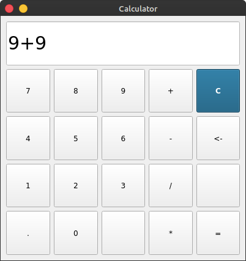

# pyqt5-calculator

A pretty simple calculator desktop app that accepts the basics operations (sum, subtraction, multiplication and division). The Graphical User Interface resembles a standard basic calculator, and was done with PyQT5 and the programming was done with vanilla Python.

